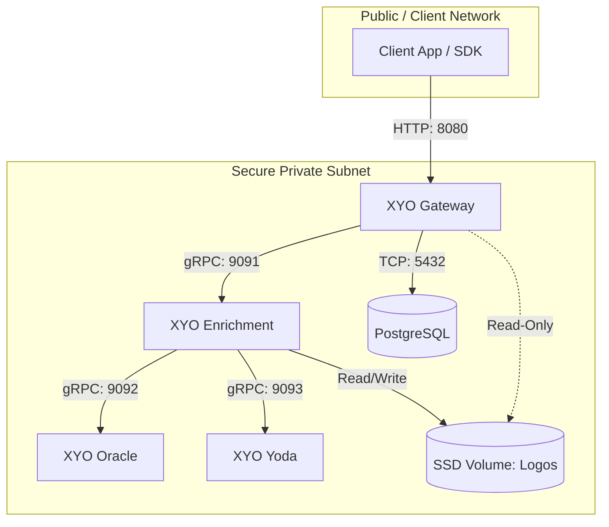

# Onboarding Enterprise & Government

This documentation provides institutional architecture specifications, container topology, deployment configurations, and SDK integration guides for deploying the **XYO Financial Transaction Enrichment Service** within private cloud, on-premises, and air-gapped sovereign government infrastructure.

---

## 🧩 Components

<p align="center">
  
</p>

### 📦 Linux Containers
The platform operates as a modular, decoupled microservice suite:

- **XYO Gateway**: Client-facing `HTTP/REST` entry point providing rate limiting, API token authentication, request validation, and caching.
- **XYO Enrichment**: Core orchestrator and internal `gRPC/RPC` server coordinating inference pipelines across downstream pattern matchers and AI models.
- **XYO Oracle**: High-speed internal pattern matcher database and deterministic rules engine.
- **XYO Yoda**: Machine learning inference service for high-dimensional semantic categorization and counterparty entity resolution.

> ℹ️ *Note: **Oracle** and **Yoda** are internal service designations representing the deterministic knowledge base and neural categorization engines, respectively.*
> - **XYO Oracle**: *Because the great Oracle knows everything.*
> - **XYO Yoda**: *Because Yoda is wise.*

### 💾 Storage Volumes & Network
- **SSD Storage**: High-IOPS persistent SSD volume for merchant asset caching and logos *(NVMe recommended)*.
- **Private Network**: Isolated private subnet for secure, low-latency inter-service communication between containers.

### 🗄️ Database <sup>(Containerised/External/Embedded)</sup>
- **Database**: PostgreSQL is the default transactional and query cache database. Can be containerized locally or connected to external enterprise clusters (e.g. AWS RDS, Azure Database for PostgreSQL, Google Cloud SQL).

---

## 🌐 Network and Connectivity

The XYO Enrichment Service relies on microservices communicating securely inside a private network subnet. Only the **XYO Gateway** needs to be exposed to your external client applications and internal consumers.



### 🔌 Port Matrix
| Component          | Default Port | Protocol | Access Level  | Description                                            |
|:-------------------|:-------------|:---------|:--------------|:-------------------------------------------------------|
| **XYO Gateway**    | `8080`       | HTTP     | Client-Facing | Serves the REST API for transaction enrichment.        |
| **XYO Enrichment** | `9091`       | TCP/RPC  | Internal Only | Internal RPC coordinator between AI models and caches. |
| **XYO Oracle**     | `9092`       | TCP/RPC  | Internal Only | Internal RPC pattern matcher database.                 |
| **XYO Yoda**       | `9093`       | TCP/RPC  | Internal Only | Internal RPC machine learning categorization service.  |
| **PostgreSQL**     | `5432`       | TCP      | Internal Only | Default transactional and cache database.              |

> 🚨 **Firewall Rule**: Ensure that ports `9091`, `9092`, and `9093` are blocked from receiving external ingress traffic, 
and are only accessible by containers within the private network.

---

## 🚚 Release and Distribution

Syniol Limited distributes the XYO Enrichment Service through container registries and compiled binaries, enabling flexible integration in Docker, Kubernetes, OpenShift, or native virtualised infrastructure.

### 🐧 Linux Images
Official Docker images are hosted on Syniol’s private registry:
- **Registry Host**: `cr.syniol.com`
- **Images**:
  - `cr.syniol.com/xyo/gateway:<version>`
  - `cr.syniol.com/xyo/enrichment:<version>`
  - `cr.syniol.com/xyo/oracle:<version>`
  - `cr.syniol.com/xyo/yoda:<version>`

Authenticate locally or in your deployment pipelines:
```bash
docker login cr.syniol.com -u <your-client-id> -p <your-client-secret>
```

### 🔨 Binary Builds
For bare-metal or legacy virtual machine environments, Syniol distributes pre-compiled static binaries for standard Linux architectures:
- **Supported Architectures**: `Linux x86_64` (AMD64) and `ARM64` (AArch64).
- **Distribution Portal**: Secure download portal at `https://downloads.syniol.com/xyo/`.
- **Verification**: SHA-256 checksums (`.sha256`) and GPG signature files (`.asc`) are provided for every build.

### 🐳 Docker & Kubernetes Support
Out-of-the-box infrastructure configurations are included directly in this repository:
- **Docker Compose**: Pre-configured environment located in [docker/](./docker). For deployment instructions, see [docker/README.md](./docker/README.md).
- **Kubernetes**: Production manifests and PVC configurations located in [kubernetes/](./kubernetes). For deployment instructions, see [kubernetes/README.md](./kubernetes/README.md).

---

## 🛠️ Using SDKs

Syniol provides official, type-safe SDK client libraries to simplify integration with the XYO Gateway HTTP API.

### 🐹 Go SDK
- **Package**: `github.com/xyo-financial/sdk-go/v2`
- **Install**:
  ```bash
  go get github.com/xyo-financial/sdk-go/v2
  ```
- **Example Usage**:
  ```go
  package main

  import (
      "context"
      "fmt"
      "log"

      "github.com/xyo-financial/sdk-go/v2"
  )

  func main() {
      // Initialize XYO client targeting your gateway endpoint
      client, err := xyo.NewClient(&xyo.Config{
          APIKey:  "your-api-key",
          BaseURL: "http://localhost:8080",
      })
      if err != nil {
          log.Fatalf("failed to initialize client: %v", err)
      }

      // Enrich a transaction payment string
      res, err := client.EnrichTransaction(context.Background(), &xyo.EnrichmentRequest{
          Content:     "AMZN Mktp US*Amzn.com/bill WA",
          CountryCode: "US",
      })
      if err != nil {
          log.Fatalf("failed to enrich: %v", err)
      }

      fmt.Printf("Merchant:    %s\n", res.Merchant)
      fmt.Printf("Description: %s\n", res.Description)
      fmt.Printf("Categories:  %v\n", res.Categories)
      fmt.Printf("Logo Asset:  %s\n", res.Logo)
      fmt.Printf("Location:    %s\n", res.Location)
      fmt.Printf("Address:     %s\n", res.Address)
  }
  ```

### 🟢 Node.js SDK
- **Package**: `xyo-sdk`
- **Install**:
  ```bash
  npm install xyo-sdk
  ```
- **Example Usage**:
  ```typescript
  import { XYOClient, type EnrichmentResponse } from 'xyo-sdk'

  const xyo = new XYOClient({
    token: 'your-api-key',
    baseUrl: 'http://localhost:8080',
  })

  async function enrichTransaction() {
    try {
      const response: EnrichmentResponse = await xyo.enrichTransaction({
        content: 'NETFLIX.COM GBR',
        countryCode: 'GB',
      })

      console.log('Merchant Name:', response.merchant)
      console.log('Description:  ', response.description)
      console.log('Categories:   ', response.categories.join(', '))
      console.log('Logo:         ', response.logo ? '[Base64 Embedded Image]' : 'N/A')
      console.log('Location:     ', response.location)
      console.log('Address:      ', response.address)
    } catch (error) {
      console.error('Enrichment failed:', error)
    }
  }

  enrichTransaction()
  ```

### 🦀 Rust SDK
- **Crate**: `xyo-sdk` (on [crates.io](https://crates.io/crates/xyo-sdk))
- **Install (`Cargo.toml`)**:
  ```toml
  [dependencies]
  xyo-sdk = "2.0.0"
  tokio = { version = "1", features = ["rt-multi-thread", "macros"] }
  ```
- **Example Usage**:
  ```rust
  use xyo_sdk::client::Client;

  #[tokio::main]
  async fn main() -> Result<(), Box<dyn std::error::Error>> {
      let token = std::env::var("XYO_API_KEY").unwrap_or_else(|_| "your-api-key".to_string());

      // Initialize client targeting the local on-premise Gateway
      let client = Client::new(token, Some("http://localhost:8080".to_string()));

      let resp = client.enrich_transaction("AMZN Mktp US*Amzn.com/bill WA", "US").await?;

      println!("Merchant:    {}", resp.merchant);
      println!("Description: {}", resp.description);
      println!("Categories:  {:?}", resp.categories);
      println!("Logo (B64):  {}", if resp.logo.is_empty() { "N/A" } else { "Available" });
      println!("Location:    {}", resp.location);
      println!("Address:     {}", resp.address);

      Ok(())
  }
  ```

### 📚 Additional SDKs
Syniol also maintains official client SDKs for other ecosystems:
- **Java SDK**: `com.xyo:xyo-sdk:1.0.0` / `com.xyo.financial:xyo-sdk` (on Maven Central).
  ```xml
  <dependency>
      <groupId>com.xyo</groupId>
      <artifactId>xyo-sdk</artifactId>
      <version>1.0.0</version>
  </dependency>
  ```
  ```java
  ClientConfig config = new ClientConfig.Builder("your-api-key")
          .apiBaseUrl("http://localhost:8080")
          .build();
  XyoClient client = new XyoClient(config);
  EnrichmentResponse res = client.enrichTransaction(new EnrichmentRequest("SPOTIFY PREMIUM", "SE"));
  ```
- **PHP Package**: `xyo/sdk` (on [packagist.org](https://packagist.org/packages/xyo/sdk)).
  ```bash
  composer require xyo/sdk
  ```
  ```php
  $config = new ClientConfig('your-api-token', null, 'http://localhost:8080');
  $client = new Client($config);
  $response = $client->enrichTransaction('UBER TRIP HELP.UBER.COM', 'US');
  ```

---

## 🔑 Licence Verification

The XYO Enrichment Service requires a valid licence key provided by Syniol Limited to initialise and download AI categorisation models.

### ☁️ Online Licensing
By default, the gateway and enrichment services check licence validity online:
1. Provide your key via the `XYO_LICENSE_KEY` environment variable.
2. The service establishes a secure TLS connection to `license.syniol.com:443`.
3. After verification, it retrieves cryptographic model keys to load the AI runtime.
4. **Heartbeats**: The service queries the server every 1 hour. If the connection is lost, it falls back to a **7-day offline grace period**.

### 🔒 Air-Gapped / Offline Licensing
For high-security on-premise deployments that prohibit outbound internet access, Syniol offers an offline cryptographic licence verification mode:
1. Syniol generates a digital licence signature file (`license.lic`) linked to your node CPU/hardware fingerprint or cluster domain.
2. Mount this file into the XYO containers at `/etc/xyo/license.lic` or define the file path using the `XYO_LICENSE_PATH` environment variable.
3. The containers validate the licence signature locally using a hardcoded public key, running 100% locally without external outbound traffic.

---

### 🔐 Licence & Governance
Copyright &copy; Syniol Limited. All rights reserved.
