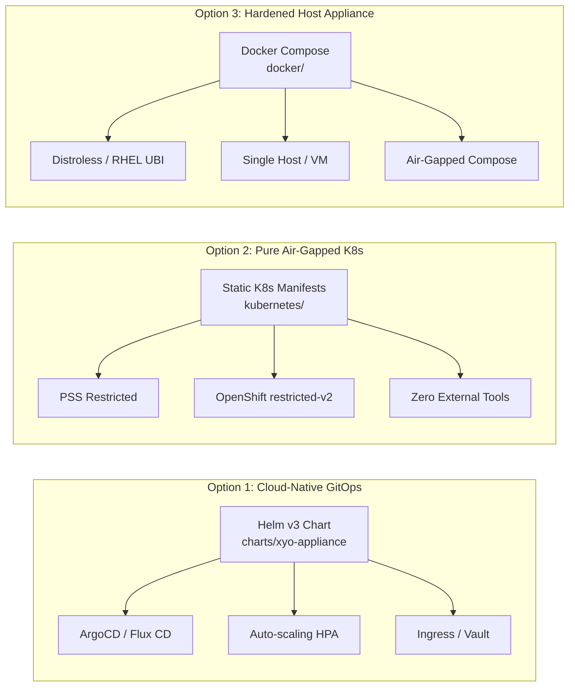
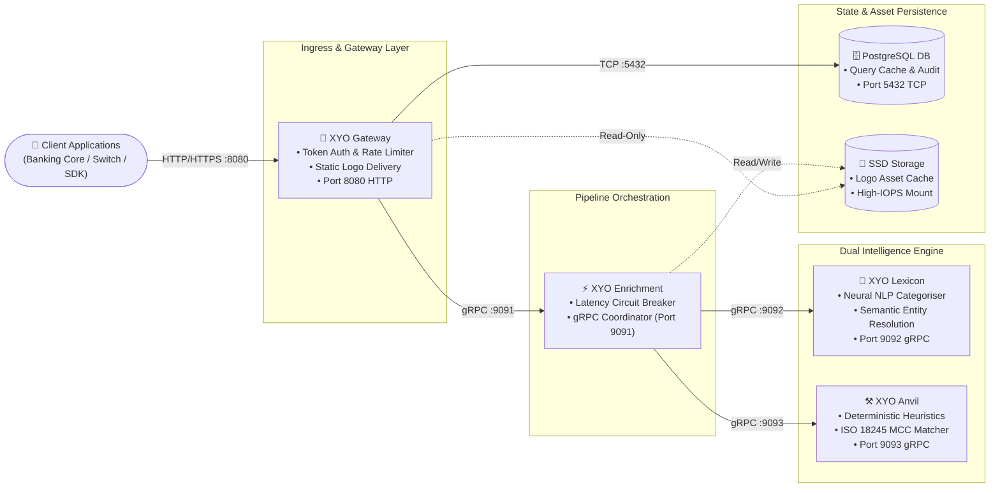
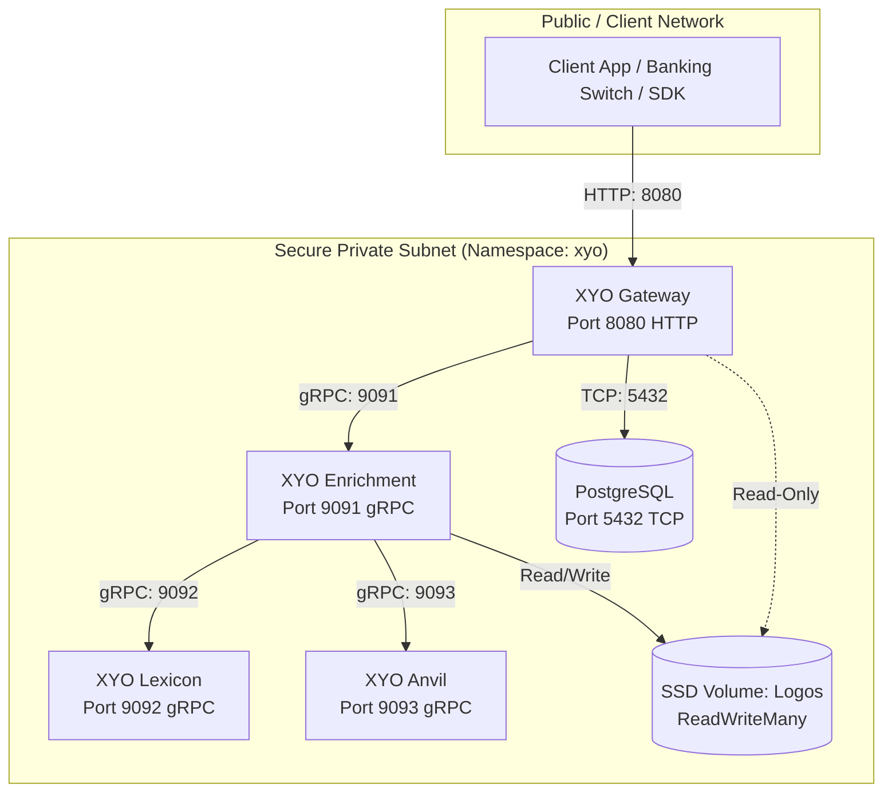

# 🏛️ Institutional Onboarding & Enterprise Architecture
## XYO Financial Transaction Enrichment Platform

This documentation provides institutional architecture specifications, container topology, deployment configurations, and SDK integration guides for deploying the **XYO Financial Transaction Enrichment Platform** within private cloud, on-premises, and air-gapped sovereign government infrastructure.

---

## 🛡️ Enterprise Pillars & High-Assurance Compliance

The XYO Enrichment Platform is engineered specifically for Tier-1 financial institutions, central banks, national payment switches, and defense-grade sovereign networks.

| Pillar | Guarantee | Technical Implementation |
| :--- | :--- | :--- |
| **Data Sovereignty & Zero PII Egress** | 100% In-Boundary Execution | Raw transaction strings, account numbers, and financial counterparty data are processed entirely in-memory within your VPC or bare-metal host. **Zero telemetry, Lexicon and Anvil models make API calls strictly to endpoints within the client's local deployment region (enforcing Regional Data Sovereignty), and zero PII egress.** |
| **Supply Chain Integrity (Cosign)** | Cryptographic Image Provenance | All OCI container images are signed with Sigstore Cosign at build time and verified against Syniol's public key before deployment. |
| **Deterministic SLA & High Throughput** | Sub-10ms P99 Latency & 99.999% SLA | Deterministic pattern matching combined with optimized ONNX/TensorRT inference engines deliver over 100,000 enrichments per second with linear horizontal scalability. |
| **Zero-Trust Hardened Security** | PSS `Restricted` & OpenShift `restricted-v2` | Pods run rootless (`UID:GID 10001:10001`), with immutable read-only root filesystems (`readOnlyRootFilesystem: true`), all Linux capabilities dropped (`drop: ["ALL"]`), and kernel privilege escalation blocked. |

---

## 🚀 3 Tier-1 Enterprise Deployment Options

Syniol provides three production-grade deployment models tailored to institutional infrastructure maturity:



### 1. ☸️ Helm v3 Production Deployment (Recommended for Cloud & GitOps)
- **Path**: [`charts/xyo-appliance`](../../charts/xyo-appliance)
- **Use Case**: Production Kubernetes (EKS, GKE, AKS, OpenShift) utilizing automated GitOps pipelines (ArgoCD, Flux, GitLab CI).
- **Features**: Parameterized values, automated Horizontal Pod Autoscaling (HPA), native Ingress/mTLS routing, HashiCorp Vault / External Secrets Operator integration, and Prometheus ServiceMonitors.
- **Quickstart**:
  ```bash
  helm upgrade --install xyo-appliance charts/xyo-appliance \
    --namespace xyo --create-namespace \
    --values my-values.yaml
  ```

### 2. 🛡️ Pure Air-Gapped Kubernetes Manifests (Declarative K8s / OpenShift)
- **Path**: [`kubernetes/`](./kubernetes) | [Read Kubernetes Guide](./kubernetes/README.md)
- **Use Case**: Highly secure, air-gapped, or regulated clusters where package managers (Helm) and external controllers are prohibited.
- **Features**: 100% declarative YAML manifests adhering strictly to Kubernetes Pod Security Standards (`PSS Restricted`) and Red Hat OpenShift (`restricted-v2` SCC).
- **Quickstart**:
  ```bash
  kubectl create namespace xyo
  kubectl apply -f kubernetes/pv-pvc.yaml
  kubectl apply -f kubernetes/postgres.yaml
  kubectl apply -f kubernetes/lexicon.yaml
  kubectl apply -f kubernetes/anvil.yaml
  kubectl apply -f kubernetes/enrichment.yaml
  kubectl apply -f kubernetes/gateway.yaml
  ```

### 3. 🐳 Hardened Docker Compose Appliance (Single-Node / On-Prem VM)
- **Path**: [`docker/`](./docker) | [Read Docker Guide](./docker/README.md)
- **Use Case**: Turnkey appliance on dedicated bare-metal Linux servers or virtual machines (VMware ESXi, Nutanix, KVM).
- **Features**: Pre-configured multi-container stack with isolated bridge networking, CPU/RAM reservations, and multi-stage hardened Google Distroless / Red Hat UBI minimal builds ([`Dockerfile.hardened`](./docker/Dockerfile.hardened)).
- **Quickstart**:
  ```bash
  cd docker
  docker compose up -d
  ```

---

## 🧩 Microservices Topology & Architecture



The platform operates as a modular, decoupled microservice suite:

- **XYO Gateway**: Client-facing `HTTP/REST` entry point providing rate limiting, API token authentication, request validation, logo asset delivery, and caching.
- **XYO Enrichment**: Core orchestrator and internal `gRPC/RPC` server coordinating inference pipelines across downstream pattern matchers and AI models.
- **XYO Lexicon**: Machine learning inference service for high-dimensional semantic categorisation and counterparty entity resolution.
- **XYO Anvil**: High-speed internal pattern matcher database and deterministic rules engine.
- **PostgreSQL**: Transactional query cache and audit persistence backend. *(Note: The bundled single-pod deployment is optimized for air-gapped POCs; for production workloads >5,000 TPS, connect to a managed HA cluster such as AWS Aurora Multi-AZ, GCP Cloud SQL, or CloudNativePG with PgBouncer connection pooling).*
- **SSD Storage**: High-IOPS persistent SSD volume for merchant asset caching and logos *(NVMe recommended)*.

### ⚡ Reliability, Circuit Breaking & Observability
* **Automated Latency Budgeting & Fallback:** To maintain strict sub-15ms SLAs in the payment authorization path, the `Enrichment` orchestrator implements automatic circuit breaking. If `Lexicon` (neural inference) exceeds its latency budget (>8ms) under high load, the engine seamlessly falls back to `Anvil` (deterministic rule matching).
* **Distributed Tracing & Correlation:** Standard W3C `traceparent` headers and `X-Correlation-ID` are propagated across all microservices for end-to-end tracing across APM tools (Datadog, Dynatrace, OpenTelemetry, Splunk).

---

## 🌐 Network Topology & Port Matrix

The XYO Enrichment Platform relies on microservices communicating securely inside a private network subnet. Only the **XYO Gateway** is exposed to external client applications.



### 🔌 Port & Protocol Matrix
| Component | Default Port | Protocol | Access Level | Description | Health Endpoint |
| :--- | :--- | :--- | :--- | :--- | :--- |
| **XYO Gateway** | `8080` | HTTP / REST | Client-Facing | Serves the REST API for transaction enrichment. | `/healthz`, `/readyz` |
| **XYO Enrichment** | `9091` | gRPC / HTTP | Internal Only | Internal RPC coordinator between AI models and caches. | `/healthz`, `/readyz` |
| **XYO Lexicon** | `9092` | gRPC / HTTP | Internal Only | Internal RPC machine learning categorisation service. | `/healthz`, `/readyz` |
| **XYO Anvil** | `9093` | gRPC / HTTP | Internal Only | Internal RPC pattern matcher database. | `/healthz`, `/readyz` |
| **PostgreSQL** | `5432` | TCP | Internal Only | Default transactional and cache database. | `pg_isready` |

> 🚨 **Firewall Rule**: Ensure that internal ports `9091`, `9092`, and `9093` are blocked from receiving external ingress traffic, and are only accessible by containers within the private network subnet.

---

## 🚚 Distribution, Verification & Supply Chain Integrity

Syniol Limited distributes the XYO Enrichment Platform through container registries and compiled binaries, enabling flexible integration across Linux architectures.

### 🐧 Container Images
Official Docker images are hosted on Syniol’s private OCI registry:
- **Registry Host**: `cr.syniol.com`
- **Images**:
  - `cr.syniol.com/xyo/gateway:v2.0.0`
  - `cr.syniol.com/xyo/enrichment:v2.0.0`
  - `cr.syniol.com/xyo/lexicon:v2.0.0`
  - `cr.syniol.com/xyo/anvil:v2.0.0`

Authenticate locally or in your deployment pipelines:
```bash
docker login cr.syniol.com -u <your-client-id> -p <your-client-secret>
```

### 🔏 Cosign Image Signature Verification
To verify cryptographic provenance and ensure images have not been tampered with:
```bash
# Download official public key
curl -s https://downloads.syniol.com/xyo/cosign.pub -o cosign.pub

# Verify image signature
cosign verify --key cosign.pub cr.syniol.com/xyo/gateway:v2.0.0
cosign verify --key cosign.pub cr.syniol.com/xyo/enrichment:v2.0.0
cosign verify --key cosign.pub cr.syniol.com/xyo/lexicon:v2.0.0
cosign verify --key cosign.pub cr.syniol.com/xyo/anvil:v2.0.0
```

### 🚢 Air-Gapped Private Registry Mirroring (Harbor / Artifactory / ECR)
To mirror signed images into your internal sovereign registry using `skopeo` or `docker`:
```bash
# Example using skopeo to copy directly to internal registry:
skopeo copy --all docker://cr.syniol.com/xyo/gateway:v2.0.0 docker://registry.internal.bank.com/xyo/gateway:v2.0.0
skopeo copy --all docker://cr.syniol.com/xyo/enrichment:v2.0.0 docker://registry.internal.bank.com/xyo/enrichment:v2.0.0
skopeo copy --all docker://cr.syniol.com/xyo/lexicon:v2.0.0 docker://registry.internal.bank.com/xyo/lexicon:v2.0.0
skopeo copy --all docker://cr.syniol.com/xyo/anvil:v2.0.0 docker://registry.internal.bank.com/xyo/anvil:v2.0.0
```

### 🔐 Enterprise Secrets Management (Vault / ESO)
For production Kubernetes environments, avoid plaintext secrets. Use the **Kubernetes External Secrets Operator (ESO)** or **HashiCorp Vault Agent** to inject database passwords and license tokens:
```yaml
apiVersion: external-secrets.io/v1beta1
kind: ExternalSecret
metadata:
  name: xyo-db-credentials
  namespace: xyo
spec:
  secretStoreRef:
    name: vault-backend
    kind: ClusterSecretStore
  target:
    name: xyo-db-secret
  data:
    - secretKey: db-dsn
      remoteRef:
        key: secret/data/xyo/database
        property: dsn
```

### 🔨 Binary Builds
For bare-metal or legacy virtual machine environments, Syniol distributes pre-compiled static binaries for standard Linux architectures:
- **Supported Architectures**: `Linux x86_64` (AMD64) and `ARM64` (AArch64).
- **Distribution Portal**: Secure download portal at `https://downloads.syniol.com/xyo/`.
- **Verification**: SHA-256 checksums (`.sha256`) and GPG signature files (`.asc`) are provided for every build.

---

## 🛠️ Official Enterprise SDKs

Syniol provides official, type-safe SDK client libraries to simplify integration with the XYO Gateway HTTP API.

### 🦫 Go SDK
- **Package**: `github.com/xyo-financial/sdk-go/v2`
- **Install**:
  ```bash
  go get github.com/xyo-financial/sdk-go/v2
  ```
- **Example Usage**:
  ```go
  package main

  import (
      "context"
      "fmt"
      "log"

      "github.com/xyo-financial/sdk-go/v2"
  )

  func main() {
      client, err := xyo.NewClient(&xyo.Config{
          APIKey:  "your-api-key",
          BaseURL: "http://localhost:8080",
      })
      if err != nil {
          log.Fatalf("failed to initialize client: %v", err)
      }

      res, err := client.EnrichTransaction(context.Background(), &xyo.EnrichmentRequest{
          Content:     "AMZN Mktp US*Amzn.com/bill WA",
          CountryCode: "US",
      })
      if err != nil {
          log.Fatalf("failed to enrich: %v", err)
      }

      fmt.Printf("Merchant:    %s\n", res.Merchant)
      fmt.Printf("Description: %s\n", res.Description)
      fmt.Printf("Categories:  %v\n", res.Categories)
      fmt.Printf("Logo Asset:  %s\n", res.Logo)
      fmt.Printf("Location:    %s\n", res.Location)
      fmt.Printf("Address:     %s\n", res.Address)
  }
  ```

### 🟢 Node.js / TypeScript SDK
- **Package**: `xyo-sdk`
- **Install**:
  ```bash
  npm install xyo-sdk
  ```
- **Example Usage**:
  ```typescript
  import { XYOClient, type EnrichmentResponse } from 'xyo-sdk'

  const xyo = new XYOClient({
    token: 'your-api-key',
    baseUrl: 'http://localhost:8080',
  })

  async function enrichTransaction() {
    try {
      const response: EnrichmentResponse = await xyo.enrichTransaction({
        content: 'NETFLIX.COM GBR',
        countryCode: 'GB',
      })

      console.log('Merchant Name:', response.merchant)
      console.log('Description:  ', response.description)
      console.log('Categories:   ', response.categories.join(', '))
      console.log('Logo:         ', response.logo ? '[Base64 Embedded Image]' : 'N/A')
      console.log('Location:     ', response.location)
      console.log('Address:      ', response.address)
    } catch (error) {
      console.error('Enrichment failed:', error)
    }
  }

  enrichTransaction()
  ```

### 🦀 Rust SDK
- **Crate**: `xyo-sdk` (on [crates.io](https://crates.io/crates/xyo-sdk))
- **Install (`Cargo.toml`)**:
  ```toml
  [dependencies]
  xyo-sdk = "2.0.0"
  tokio = { version = "1", features = ["rt-multi-thread", "macros"] }
  ```
- **Example Usage**:
  ```rust
  use xyo_sdk::client::Client;

  #[tokio::main]
  async fn main() -> Result<(), Box<dyn std::error::Error>> {
      let token = std::env::var("XYO_API_KEY").unwrap_or_else(|_| "your-api-key".to_string());

      let client = Client::new(token, Some("http://localhost:8080".to_string()));
      let resp = client.enrich_transaction("AMZN Mktp US*Amzn.com/bill WA", "US").await?;

      println!("Merchant:    {}", resp.merchant);
      println!("Description: {}", resp.description);
      println!("Categories:  {:?}", resp.categories);
      println!("Logo (B64):  {}", if resp.logo.is_empty() { "N/A" } else { "Available" });
      println!("Location:    {}", resp.location);
      println!("Address:     {}", resp.address);

      Ok(())
  }
  ```

### ☕ Java SDK
- **Artifact**: `io.github.xyo-financial:xyo-sdk:2.1.0`
  ```xml
  <dependency>
      <groupId>io.github.xyo-financial</groupId>
      <artifactId>xyo-sdk</artifactId>
      <version>2.1.0</version>
  </dependency>
  ```
  ```java
  ClientConfig config = ClientConfig.builder("your-api-key")
          .baseUrl("http://localhost:8080")
          .build();
  XyoClient client = new XyoClient(config);
  EnrichmentRequest req = new EnrichmentRequest();
  req.setContent("SPOTIFY PREMIUM");
  req.setCountryCode("SE");
  EnrichmentResponse res = client.enrichTransaction(req);
  ```

### 🐍 Python SDK
- **Package**: `xyo-sdk` (on [pypi.org](https://pypi.org/project/xyo-sdk/))
  ```bash
  pip install xyo-sdk
  ```
  ```python
  from xyo import Client, ClientConfig

  config = ClientConfig(api_key="your-api-key", base_url="http://localhost:8080")
  with Client(config=config) as client:
      response = client.enrich_transaction("UBER TRIP HELP.UBER.COM", "US")
      print(f"Merchant: {response.merchant} -> {response.categories}")
  ```

### 🔷 .NET / C# SDK
- **Package**: `Xyo.Sdk` (on [nuget.org](https://www.nuget.org/packages/Xyo.Sdk))
  ```bash
  dotnet add package Xyo.Sdk
  ```
  ```csharp
  using Xyo.Sdk;

  var config = new ClientConfig { ApiKey = "your-api-key", BaseUrl = "http://localhost:8080" };
  using var client = new XyoClient(config);
  var response = await client.EnrichTransactionAsync(new EnrichmentRequest("STARBUCKS STORE", "US"));
  ```

---

## 🔑 Licence Verification & Air-Gapped Activation

The XYO Enrichment Platform requires an enterprise licence key provided by Syniol Limited to initialize and activate AI categorization models.

### ☁️ Online Licensing
By default, the gateway and enrichment services verify licence validity online:
1. Provide your key via the `XYO_LICENSE_KEY` environment variable.
2. The service establishes an outbound TLS connection to `license.syniol.com:443`.
3. After verification, cryptographic runtime keys are loaded.
4. **Resilience**: Heartbeats are verified hourly with an automatic **7-day offline grace period** if network connectivity is interrupted.

### 🔒 Air-Gapped / Offline Licensing
For sovereign environments that prohibit outbound network traffic:
1. Syniol issues an asymmetric digital licence signature file (`license.lic`) linked to your cluster identity or hardware fingerprint.
2. Mount this file into the XYO containers at `/etc/xyo/license.lic` or set `XYO_LICENSE_PATH=/etc/xyo/license.lic`.
3. The runtime cryptographically validates the signature locally against Syniol's embedded public key, operating 100% offline with zero outbound calls.

---

### 🔐 Licence & Governance
Copyright &copy; Syniol Limited. All rights reserved.

