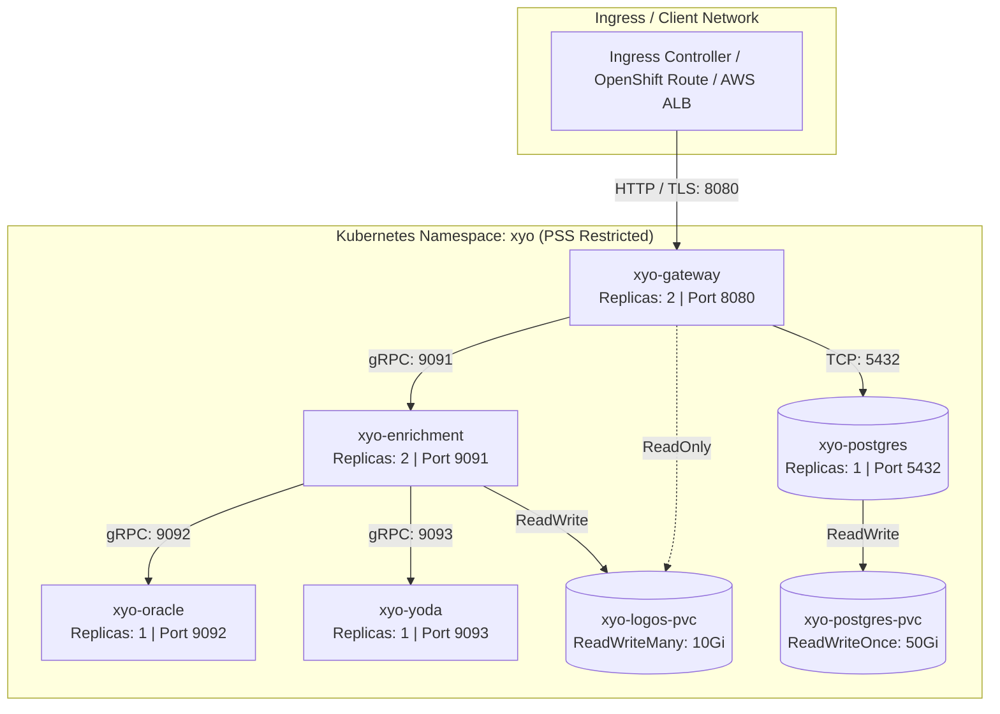

# ☸️ XYO Enterprise Kubernetes Deployment Guide

This guide provides institutional architecture specifications, security hardening procedures, and step-by-step instructions for deploying the **XYO Financial Transaction Enrichment Appliance** on production Kubernetes clusters and Red Hat OpenShift Container Platforms.

---

## 🏛️ Architecture & Security Profile

The Kubernetes deployment provides horizontal scalability, zero-downtime rolling updates, and strict isolation for Tier-1 financial institutions and sovereign government clouds.



### 🛡️ Compliance & Security Hardening Matrix

| Security Domain | Specification | Implementation in Manifests |
| :--- | :--- | :--- |
| **Pod Security Standards (PSS)** | `Restricted` (Kubernetes 1.25+) | All pods enforce `seccompProfile: RuntimeDefault`, `runAsNonRoot: true`, `runAsUser: 10001`, `runAsGroup: 10001`. |
| **OpenShift SCC** | `restricted-v2` | Zero privileged containers, UID/GID 10001:10001, no host network/PID/IPC, all capabilities dropped. |
| **Filesystem Immutability** | `readOnlyRootFilesystem: true` | Container root filesystems are mounted read-only; ephemeral storage is isolated via size-limited in-memory `emptyDir` mounts (`/tmp`, `/run`). |
| **Linux Capabilities** | Zero privileges | `capabilities: drop: ["ALL"]` on every container. |
| **Privilege Escalation** | Disallowed | `allowPrivilegeEscalation: false` enforced across all workloads. |
| **Resource Isolation** | Deterministic CPU / RAM QoS | Guaranteed CPU and Memory `requests` and `limits` prevent noisy neighbor interference. |
| **Health & Readiness** | Dual-stage Probing | `/healthz` (liveness) and `/readyz` (readiness) probes prevent traffic routing to unready pods. |

---

## 📦 Deployment Options

Syniol provides two Tier-1 enterprise deployment mechanisms:

1. **Helm v3 Production Deployment (Recommended for GitOps & Automation)**:
   - Packaged Helm chart located at [`charts/xyo-appliance`](../../../charts/xyo-appliance).
   - Manages parameters, ingress configurations, horizontal pod autoscalers (HPA), secrets integration (HashiCorp Vault / External Secrets Operator), and multi-cluster GitOps workflows (ArgoCD / Flux).
2. **Pure Air-Gapped Kubernetes Manifests**:
   - Static, declarative YAML manifests in this directory (`kubernetes/`).
   - Zero external chart dependencies; ideal for air-gapped, sovereign, or strictly isolated Kubernetes clusters.

---

## 🚀 Step-by-Step Production Deployment

### Step 1: Create Namespace with PSS `Restricted` Enforcement

Create the dedicated `xyo` namespace and apply Pod Security Standard labels:

```bash
kubectl create namespace xyo

# Enforce Pod Security Standards (PSS) Restricted policy
kubectl label --overwrite namespace xyo \
  pod-security.kubernetes.io/enforce=restricted \
  pod-security.kubernetes.io/enforce-version=latest \
  pod-security.kubernetes.io/audit=restricted \
  pod-security.kubernetes.io/warn=restricted
```

### Step 2: OpenShift SCC Compatibility (`restricted-v2`)

If deploying on Red Hat OpenShift Container Platform (4.12+), ensure the ServiceAccount satisfies the `restricted-v2` Security Context Constraint:

```bash
# Verify SCC compatibility or explicitly assign restricted-v2 to default service account
oc adm policy add-scc-to-user restricted-v2 -z default -n xyo
```

> ℹ️ *All XYO container images are engineered to comply with OpenShift `restricted-v2` out of the box with non-root UID `10001` and dropped capabilities.*

### Step 3: Configure Private Registry Authentication

Configure Kubernetes to authenticate with Syniol’s private OCI registry (`cr.syniol.com`):

```bash
kubectl create secret docker-registry syniol-registry-secret \
  --docker-server=cr.syniol.com \
  --docker-username="<your-institution-client-id>" \
  --docker-password="<your-institution-client-secret>" \
  --namespace=xyo
```

#### Cosign Image Signature Verification (Supply Chain Integrity)
In high-assurance environments, verify container image signatures using Sigstore Cosign before deployment:

```bash
# Verify image signature against Syniol official release public key
cosign verify \
  --key https://downloads.syniol.com/xyo/cosign.pub \
  cr.syniol.com/xyo/gateway:v2.0.0
```

### Step 4: Configure the Licence Secret

Deploy your enterprise activation key into a Kubernetes Secret:

```bash
kubectl create secret generic xyo-license-secret \
  --from-literal=license-key="XYO-ENT-PROD-XXXXX-XXXXX-XXXXX" \
  --namespace=xyo
```

> 🔒 *For air-gapped offline licence verification, see [Air-Gapped Licensing in README.md](../README.md#air-gapped--offline-licensing) and mount `license.lic` via Secret volume.*

### Step 5: Provision Persistent Storage

Apply the PersistentVolumeClaims for logo assets and transactional persistence:

```bash
kubectl apply -f pv-pvc.yaml
```

> 💡 **StorageClass Recommendation**:
> - **`xyo-logos-pvc` (ReadWriteMany - RWX)**: Requires multi-pod write capability (AWS EFS CSI `efs-sc`, Azure Files `azurefile-csi-premium`, GCP Filestore `filestore-csi`, or OpenShift CephFS `ocs-storagecluster-cephfs`).
> - **`xyo-postgres-pvc` (ReadWriteOnce - RWO)**: Low-latency SSD block storage (AWS EBS `gp3`, Azure Managed Disk `managed-csi-premium`, GCP `premium-rwo`, or OpenShift Ceph-RBD).

### Step 6: Deploy Services in Topological Order

Apply the manifests in sequential order to ensure upstream dependencies initialize cleanly:

```bash
# 1. Deploy transactional cache database
kubectl apply -f postgres.yaml

# 2. Deploy rules engine and machine learning inference services
kubectl apply -f oracle.yaml
kubectl apply -f yoda.yaml

# 3. Deploy enrichment orchestration coordinator
kubectl apply -f enrichment.yaml

# 4. Deploy public API Gateway entrypoint
kubectl apply -f gateway.yaml
```

---

## 🔍 Verification & Health Diagnostics

### 1. Pod Lifecycle & Status Check

Verify that all pods are running and probe checks are healthy:

```bash
kubectl get pods -n xyo -o wide
```

Expected output:
```text
NAME                              READY   STATUS    RESTARTS   AGE
xyo-enrichment-7d94cfbb-4f89a     1/1     Running   0          45s
xyo-enrichment-7d94cfbb-8c2kl     1/1     Running   0          45s
xyo-gateway-65c8f8b89d-7r4w2      1/1     Running   0          30s
xyo-gateway-65c8f8b89d-9q1nm      1/1     Running   0          30s
xyo-oracle-56d6b7b75f-2zxq8       1/1     Running   0          60s
xyo-postgres-5c4d9bc99b-5vljk     1/1     Running   0          75s
xyo-yoda-747f4f9f68-6pxvd         1/1     Running   0          60s
```

### 2. Verify Services & Endpoints

```bash
kubectl get svc -n xyo
```

### 3. Local Port-Forward Testing

To run a verification test against the Gateway:

```bash
kubectl port-forward svc/xyo-gateway 8080:8080 -n xyo
```

Execute a test enrichment query via `curl`:

```bash
curl -s -X POST http://localhost:8080/v1/enrich \
  -H "Content-Type: application/json" \
  -H "Authorization: Bearer test-api-key" \
  -d '{
    "description": "AMZN Mktp US*Amzn.com/bill WA",
    "countryCode": "US"
  }' | jq .
```

Expected JSON response:
```json
{
  "merchant": "Amazon",
  "description": "AMZN Mktp US*Amzn.com/bill WA",
  "categories": ["Shopping", "E-Commerce", "Marketplace"],
  "logo": "data:image/png;base64,iVBORw0KGgoAAAANSUhEUgAA...",
  "location": "Seattle, WA",
  "address": "410 Terry Ave N, Seattle, WA 98109, United States"
}
```

---

## 🔒 Enterprise Ingress & TLS Termination

To expose `xyo-gateway` to institutional consumer applications, configure an Ingress resource with TLS termination:

```yaml
apiVersion: networking.k8s.io/v1
kind: Ingress
metadata:
  name: xyo-gateway-ingress
  namespace: xyo
  annotations:
    kubernetes.io/ingress.class: "nginx"
    nginx.ingress.kubernetes.io/backend-protocol: "HTTP"
    nginx.ingress.kubernetes.io/proxy-body-size: "8m"
    nginx.ingress.kubernetes.io/ssl-redirect: "true"
spec:
  tls:
    - hosts:
        - xyo.internal.bank.net
      secretName: xyo-tls-cert
  rules:
    - host: xyo.internal.bank.net
      http:
        paths:
          - path: /
            pathType: Prefix
            backend:
              service:
                name: xyo-gateway
                port:
                  number: 8080
```

---

## 📊 High Availability & SLA Recommendations

1. **Horizontal Pod Autoscaling (HPA)**: Configure HPA on `xyo-gateway` and `xyo-enrichment` targeting 70% CPU utilization to maintain <10ms latency SLAs under peak transaction volumes.
2. **Managed Database**: For Tier-1 production environments with multi-AZ failover, replace the containerized PostgreSQL deployment with a managed enterprise cluster (e.g., AWS RDS PostgreSQL Multi-AZ, Azure Flexible Server, or GCP Cloud SQL) by updating `XYO_DB_DSN` in [`gateway.yaml`](./gateway.yaml).
3. **Network Policies**: Enforce strict egress rules denying all outbound traffic except DNS (`53/udp`), PostgreSQL (`5432/tcp`), and optional license telemetry.

