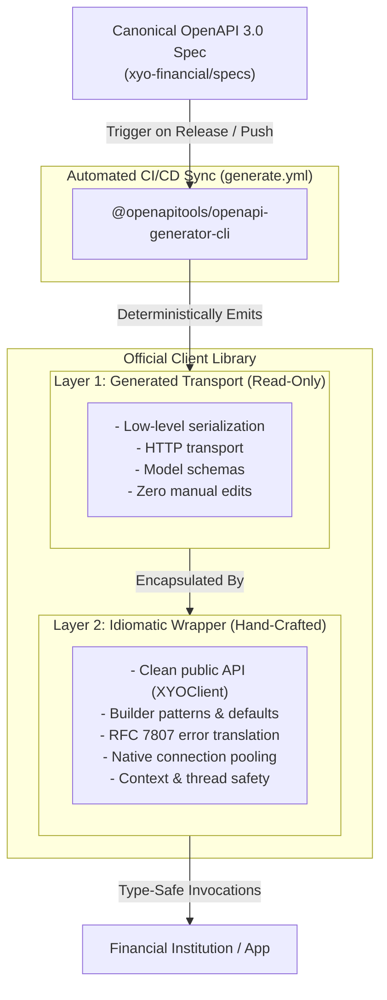

# XYO SDK Architecture & Design Principles

<p align="center">
  <b>Deterministic Code Generation, Zero-Drift Synchronization, and Idiomatic Ergonomics</b>
</p>

---

## 🏛️ Executive Architectural Summary

The **XYO Financial SDK Suite** is engineered to meet the reliability, security, and performance standards required by Tier-1 financial institutions and high-throughput payment processors.

To eliminate human error and synchronization drift between backend APIs and client libraries across seven different programming ecosystems (C++, Rust, Go, Java, .NET, Python, Node.js / TypeScript), XYO adopts a **Deterministic Two-Layer Architecture**.



---

## 🧩 The Two-Layer Architecture

Every official XYO client library is strictly bifurcated into two distinct layers:

### Layer 1: The Generated Transport Layer (`/openapi`, `/src/generated`, `/lib`)
- **Origin**: 100% machine-generated from [`xyo-financial/specs`](https://github.com/xyo-financial/specs) using OpenAPI Generator v7.x.
- **Responsibilities**: Low-level wire protocol encoding/decoding, endpoint route mappings, HTTP header serialization, and base data structures.
- **Governance**: Strictly **READ-ONLY**. Manual modifications are prohibited and automatically overwritten during upstream schema synchronization.

### Layer 2: The Idiomatic Wrapper Layer (`/src`, `/include`, `xyo-sdk`)
- **Origin**: Hand-crafted and maintained by language specialists for each respective ecosystem.
- **Responsibilities**:
  - **Ergonomic Client Facades**: Clean entry points (e.g., `new XYOClient()`, `xyo.NewClient()`, `Client::new()`, `XyoClient.builder()`).
  - **Error Taxonomy & Problem Details**: Translating HTTP failures into structured RFC 7807 exception hierarchies (`ClientException`, `ServerException`, `NetworkException`, `xyo::Error`).
  - **Memory & Resource Safety**: Enforcing C++17 PIMPL pointer isolation, Rust `Send + Sync` thread safety, and Go `context.Context` cancellation.
  - **Sensible Defaults**: Automatic timeout budgeting (e.g. 30s default), connection reuse, and custom base URL overrides for mock/sandbox testing.

---

## ⚡ Canonical 3-Operation Integration Model

Regardless of language, all XYO client libraries expose a unified 3-operation surface:

```
+-----------------------------------------------------------------------------------+
| 1. enrichTransaction(request)       -> Real-time synchronous card auth enrichment |
| 2. enrichTransactions(batch)        -> High-throughput bulk settlement ingestion  |
| 3. getEnrichmentStatus(jobId)       -> Deterministic polling for completed batches|
+-----------------------------------------------------------------------------------+
```

| Operation | Protocol / Method | Primary Use Case | Target SLA |
|---|---|---|---|
| **`enrichTransaction`** | `POST /v1/ai/finance/enrichment/transaction` | Point-of-sale card authorization, real-time banking apps | `< 15ms` |
| **`enrichTransactions`** | `POST /v1/ai/finance/enrichment/transactions` | Nightly ledger clearing, batch settlement files (100k+ records) | Asynchronous Queue |
| **`getEnrichmentStatus`** | `GET /v1/ai/finance/enrichment/status/{id}` | Polling for batch completion and archive download links | Polling Loop |

---

## 🔒 Security & Reliability Guarantees

1. **Zero PII Leakage**: The SDKs only transmit merchant narrative strings (`content`) and ISO country codes (`countryCode`). No PAN, CVV, cardholder names, or banking account numbers ever touch the client transport layer.
2. **TLS 1.3 Strict Enforcement**: All communication is enforced over TLS 1.3 with modern AEAD cipher suites.
3. **Deterministic Error Handling (RFC 7807)**: API errors strictly adhere to the `application/problem+json` standard (`type`, `title`, `status`, `detail`, `instance`), allowing automated mitigation (e.g., DLQ routing for 400s, exponential backoff for 429s, circuit breaking for 5xx).
4. **Mocked HTTP Integration Test Suites**: Every SDK repository includes dedicated integration test suites (Node native test runner, Go `testing`, Rust `wiremock`, Java JUnit 5, C++ `MockHttpServer`, .NET xUnit, Python pytest) verifying end-to-end payload serialization and error translation.

---

## 🛠️ Multi-Language Implementation Matrix

| Language | Generated Target | Wrapper Implementation | Key Concurrency / Transport Model |
|---|---|---|---|
| **C++ (C++17)** | `cpp-restsdk` *(reference only, not built or shipped)* | `xyo::Client` with PIMPL, hand-written transport | Header isolation via `std::unique_ptr<Impl>` + `cpr` / libcurl |
| **Rust** | `rust` (`openapi-client`) | `Client` in `src/client.rs` | Async `tokio` runtime + `reqwest` with `rustls` |
| **Go (Golang)** | `go` (`openapi` package) | `Client` in `client.go` | `context.Context` cancellation & native `net/http` connection pooling |
| **Java (Java 17+)** | `java` (Native library) | `XyoClient` in `xyo-sdk` | Java 17+ `java.net.http.HttpClient` + fluent builders |
| **.NET / C# (.NET 8+)** | `csharp` | `XyoClient` in `src/` | Pooled `SocketsHttpHandler` + Polly resilient retry policies |
| **Python (3.9+)** | `python` | `Client` & `AsyncClient` | `httpx` sync/async transport + thread-offloaded decompression |
| **Node.js / TypeScript** | `typescript-fetch` | `XYOClient` in `src/index.ts` | Native Web `fetch` (Zero runtime dependencies) |

---

### 🔐 Licence & Governance
Copyright &copy; 2026 <a href="https://syniol.com" target="_blank">Syniol Limited</a>. All rights reserved.  
Distributed under the **Apache License, Version 2.0**.
