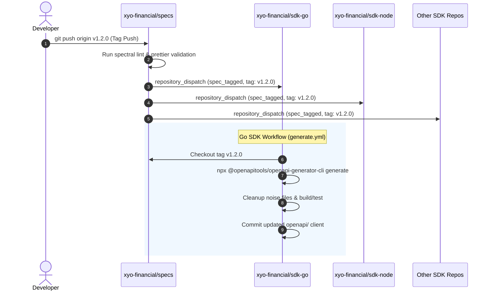

# XYO Financial SDK Ecosystem Guide

<p align="center">
  <b>Multi-Language Client Generation, Cross-Repository CI/CD Pipeline, and Integration Guide</b>
</p>

---

## 🏛️ Ecosystem Overview

The **XYO Financial SDK Suite** provides official, production-grade client libraries across multiple programming languages. Every SDK synchronises with the canonical OpenAPI 3.0 specification maintained in [`xyo-financial/specs`](https://github.com/xyo-financial/specs), so the wire contract stays consistent across all client implementations.

Six SDKs generate their transport layer from the specification and wrap it by hand. **C++ is the exception**: its transport is hand-written on `cpr`, and the generated layer is kept as a development reference that is never built, linked or shipped. See [`sdk-cpp#29`](https://github.com/xyo-financial/sdk-cpp/issues/29).

### Supported Language SDKs

> [!NOTE]
> The **Version** column is updated automatically when a release tag is pushed in the respective SDK repository, so it always reflects the current published release. Do not edit it by hand.

| Language | Repository | Package / Module Name | Generator | Shipped Transport | Version | Status |
|---|---|---|---|---|---|---|
| **C++ (C++17)** | [`xyo-financial/sdk-cpp`](https://github.com/xyo-financial/sdk-cpp) | `xyo-sdk` | `cpp-restsdk` *(reference only)* | Hand-written on `cpr` | `v2.1.0` | **Stable** |
| **Rust** | [`xyo-financial/sdk-rust`](https://github.com/xyo-financial/sdk-rust) | `xyo-sdk` | `rust` (`openapi-client`) | Generated | `v2.1.0` | **Stable** |
| **Go (Golang)** | [`xyo-financial/sdk-go`](https://github.com/xyo-financial/sdk-go) | `github.com/xyo-financial/sdk-go/v2` | `go` (`openapi` package) | Generated | `v2.1.1` | **Stable** |
| **Java (Java 17+)** | [`xyo-financial/sdk-java`](https://github.com/xyo-financial/sdk-java) | `io.github.xyo-financial:xyo-sdk` | `java` (Native library) | Generated | `v2.1.0` | **Stable** |
| **.NET / C# (.NET 8+)** | [`xyo-financial/sdk-dotnet`](https://github.com/xyo-financial/sdk-dotnet) | `Xyo.Sdk` | `csharp` | Generated | `v2.1.0` | **Stable** |
| **Python (3.9+)** | [`xyo-financial/sdk-python`](https://github.com/xyo-financial/sdk-python) | `xyo-sdk` | `python` | Generated | `v2.1.0` | **Stable** |
| **Node.js / TypeScript** | [`xyo-financial/sdk-node`](https://github.com/xyo-financial/sdk-node) | `xyo-sdk` | `typescript-fetch` | Generated | `v2.1.0` | **Stable** |

---

## 🔄 Cross-Repository Automated Code Generation

The SDK generation pipeline operates across two layers: **Upstream Canonical Specs** and **Downstream Language SDKs**.



---

## ⚙️ CI/CD Workflow Architecture

### 1. Upstream Dispatcher (`xyo-financial/specs`)

The [`specs` repository](https://github.com/xyo-financial/specs) contains a central dispatch workflow ([`.github/workflows/dispatch.yml`](https://github.com/xyo-financial/specs/blob/main/.github/workflows/dispatch.yml)) triggered on any tag push or manual workflow dispatch:

```yaml
name: Dispatch SDKs Regeneration

on:
  push:
    tags:
      - 'v[0-9]+.[0-9]+.[0-9]+'
  workflow_dispatch:
    inputs:
      tag:
        description: 'Tag or ref to dispatch to SDKs'
        required: false
        default: 'main'

jobs:
  dispatch:
    name: Dispatch Event to SDKs
    runs-on: ubuntu-latest
    strategy:
      matrix:
        repo:
          - xyo-financial/sdk-cpp
          - xyo-financial/sdk-rust
          - xyo-financial/sdk-go
          - xyo-financial/sdk-java
          - xyo-financial/sdk-dotnet
          - xyo-financial/sdk-python
          - xyo-financial/sdk-node
      fail-fast: false

    steps:
      - name: Dispatch ${{ matrix.repo }}
        uses: peter-evans/repository-dispatch@v3
        with:
          token: ${{ secrets.SDK_DISPATCH_TOKEN || secrets.DISPATCH_TOKEN || secrets.GITHUB_TOKEN }}
          repository: ${{ matrix.repo }}
          event-type: spec_tagged
          # inputs.tag must come first. github.ref_name is populated on every event,
          # workflow_dispatch included, so putting it first short-circuits the fallback
          # and makes the manual input unreachable.
          client-payload: '{"tag": "${{ inputs.tag || github.ref_name }}"}'
```

### 2. Downstream SDK Consumer (`xyo-financial/sdk-go` example)

Each language SDK repository has a generation workflow (e.g. [`.github/workflows/generate.yml`](https://github.com/xyo-financial/sdk-go/blob/main/.github/workflows/generate.yml)) configured to handle incoming `repository_dispatch` events and checkout the target release tag:

```yaml
name: Regenerate Go OpenAPI Client

on:
  repository_dispatch:
    # specs only ever emits spec_tagged; spec_updated was retired fleet-wide
    types: [spec_tagged]
  workflow_dispatch:
    inputs:
      spec_tag:
        description: 'Tag or branch in xyo-financial/specs to generate from'
        required: false
        default: 'main'

jobs:
  regenerate:
    runs-on: ubuntu-latest
    permissions:
      contents: write

    steps:
      - name: Checkout SDK repository
        uses: actions/checkout@v4

      - name: Checkout OpenAPI specification
        uses: actions/checkout@v4
        with:
          repository: xyo-financial/specs
          ref: ${{ github.event.client_payload.tag || inputs.spec_tag || 'main' }}
          path: specs

      - name: Set up Node.js (for openapi-generator-cli)
        uses: actions/setup-node@v4
        with:
          node-version: '20'

      - name: Set up Go
        uses: actions/setup-go@v5
        with:
          go-version: '1.21'

      - name: Generate OpenAPI Go client
        run: |
          npx -y @openapitools/openapi-generator-cli generate \
            -i specs/openapi.yml \
            -g go \
            -o openapi \
            --additional-properties=packageName=openapi,withGoMod=false,hideGenerationTimestamp=true \
            --global-property apiTests=false,modelTests=false,apiDocs=false,modelDocs=false

          # Remove generator scaffolding artifacts
          rm -f openapi/git_push.sh \
                openapi/.travis.yml \
                openapi/README.md
          rm -rf openapi/test \
                 openapi/docs \
                 openapi/api

          # Clean up temporary specs checkout
          rm -rf specs

      - name: Build and vet the Golang SDK
        run: |
          go build ./...
          go vet ./...

      - name: Create Pull Request
        uses: peter-evans/create-pull-request@v6
        with:
          token: ${{ secrets.SDK_DISPATCH_TOKEN || secrets.GITHUB_TOKEN }}
          commit-message: "chore: regenerate OpenAPI client from spec ${{ github.event.client_payload.tag || inputs.spec_tag || 'latest' }}"
          title: "Automated SDK Update"
          branch: "chore/auto-update-sdk"
          delete-branch: true
```

---

## 🛡️ Code Quality & Linter Policies for Generated Code

### The Immutability Rule
**Under no circumstances should code inside generated directories (`openapi/`, `src/generated/`, `lib/`) be manually edited or reformatted.** Any manual edits will be overwritten in subsequent generator cycles.

### Ignoring Generated Directories in Linters
To ensure linters do not fail builds on auto-generated code, linter configurations must explicitly ignore the generated paths.

#### Golang (`.golangci.yml`):
```yaml
run:
  timeout: 5m

linters:
  enable:
    - govet
    - errcheck
    - staticcheck
    - unused
    - gosimple
    - ineffassign
    - typecheck

issues:
  exclude-dirs:
    - openapi
  exclude-rules:
    - path: openapi/
      linters:
        - errcheck
        - gosimple
        - govet
        - ineffassign
        - staticcheck
        - typecheck
        - unused
```

---

## 🛠️ Local Generation & Development Workflow

To regenerate the client library locally when working in a development workspace:

1. **Ensure Prerequisites:**
   - Node.js 18+ with `npx`
   - Language toolchain (Go 1.22+, Node 20+, Rust 1.75+, Java 17+, C++17, Python 3.9+, .NET 8+)

2. **Execute Local Generator (From SDK Root):**
   ```bash
   npx @openapitools/openapi-generator-cli generate \
     -i ../specs/openapi.yml \
     -g go \
     -o ./openapi \
     --additional-properties=packageName=openapi,withGoMod=false,hideGenerationTimestamp=true
   ```

3. **Clean Up Noise Files:**
   ```bash
   rm -f openapi/git_push.sh openapi/.travis.yml openapi/README.md
   rm -rf openapi/test openapi/docs openapi/api
   ```

4. **Verify Quality Gates:**
   ```bash
   make check    # Formats non-generated code, runs vet, and executes test suites
   make build    # Runs full containerized verification
   ```

---

## 🔑 GitHub Secrets Configuration

To enable cross-repository event dispatching:

- **Secret Name:** `SDK_DISPATCH_TOKEN`
- **Location:** Set in `xyo-financial/specs` repository secrets (or organization-level secrets).
- **Permissions Required:** GitHub Personal Access Token (Classic) with `repo` scope, or Fine-Grained Token with `Contents: Read and write` permissions across all SDK repositories (`xyo-financial/sdk-*`).

---

### 🔐 Licence & Governance
Copyright &copy; 2026 <a href="https://syniol.com" target="_blank">Syniol Limited</a>. All rights reserved.  
Distributed under the **Apache License, Version 2.0**.
